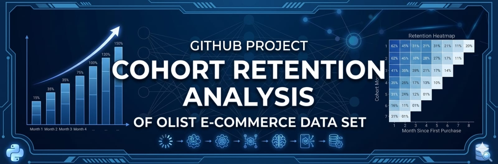
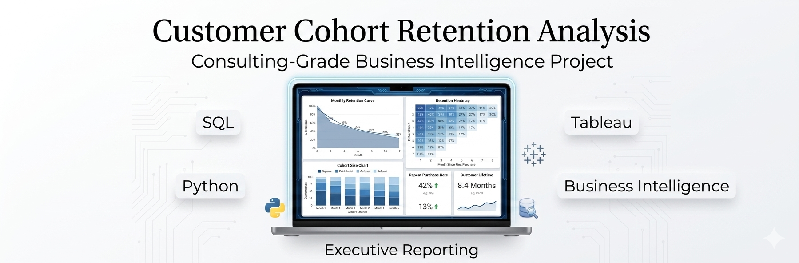
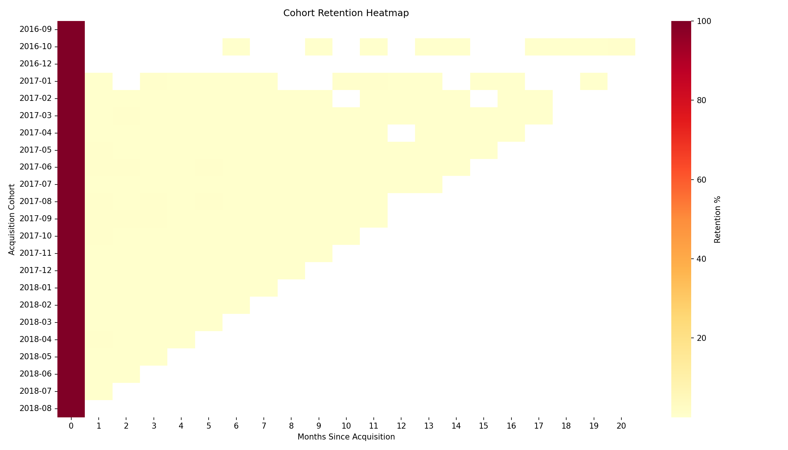
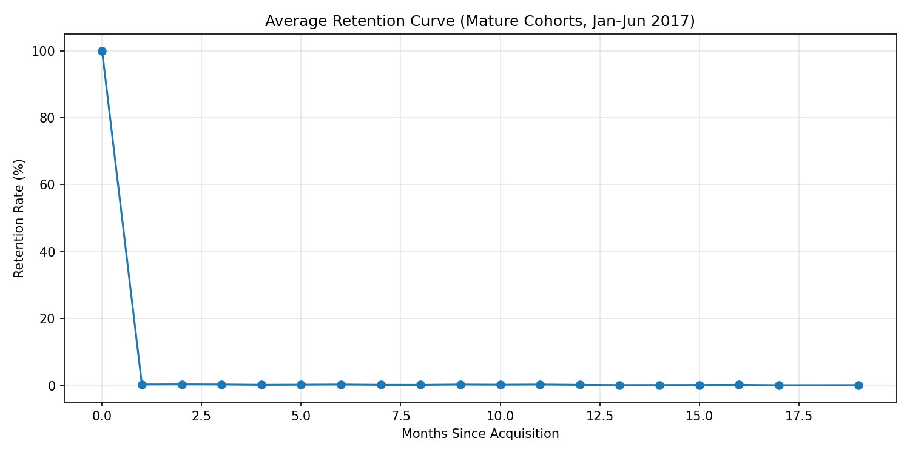
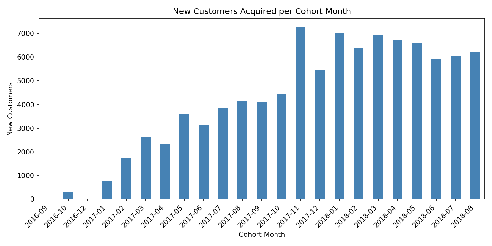
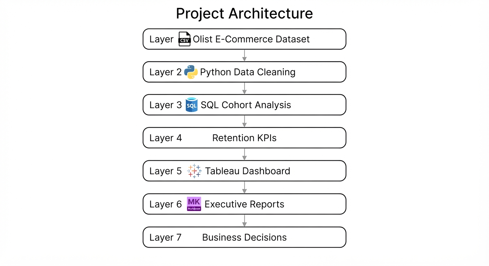
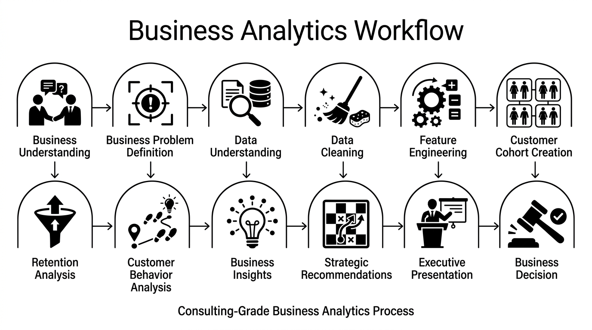
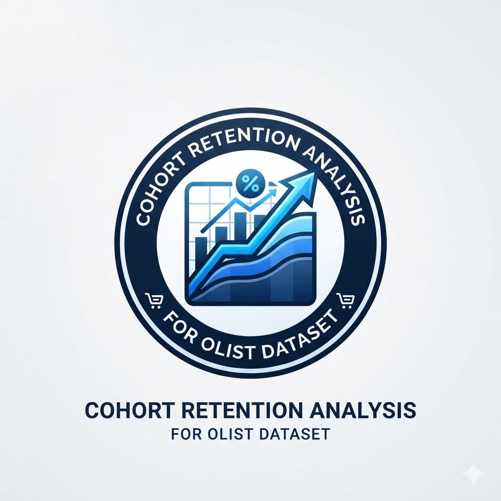

<div align="center">



<br>

# Customer Cohort Retention Analysis
### A Full-Lifecycle E-Commerce Retention Engagement — from Raw Orders to Executive Decision

**Delivering customer retention intelligence through SQL, Python, and Business Analytics — to help executives understand why customers fail to return, and what to do next.**

Apex AnalyticX · E-Commerce Customer Intelligence Series · Project 3 of 4

[](sql/)
[](python/)
[](dashboard/)
[](docs/)
[](reports/)
[](LICENSE)
[](https://github.com/theammarngp-makes/E-commerce-cohort-retention-analysis/stargazers)
[](https://github.com/theammarngp-makes/E-commerce-cohort-retention-analysis/network)
[](https://github.com/theammarngp-makes/E-commerce-cohort-retention-analysis/issues)
[](https://github.com/theammarngp-makes/E-commerce-cohort-retention-analysis)


[Executive Summary](#executive-summary) · [Dashboard](#dashboard) · [Insights](#business-insights) · [Recommendations](#strategic-recommendations) · [SQL](sql/) · [Python](python/) · [Reports](#reports--presentation) · [Skills](#skills-demonstrated) · [For Recruiters](#for-recruiters)

</div>

---

## Project At A Glance

| | | | |
|---|---|---|---|
| **Industry** | E-Commerce | **SQL** | PostgreSQL |
| **Domain** | Customer Analytics | **Python** | Pandas, Matplotlib, Seaborn |
| **Duration** | Sep 2016 – Aug 2018 | **Dashboard** | Tableau |
| **Dataset** | Olist (Kaggle) | **Reports** | 3 (Exec / Mgmt / Client) |
| **Customers** | 95,560 | **Documentation** | 15 business documents |
| **Cohorts** | 23 | **Status** | Complete — ready for pilot |

---

## Executive Summary

Across 23 monthly acquisition cohorts, this engagement measured how many customers return to purchase again after their first order — and found that they almost never do.

> **Average month-1 retention is just 0.33%.** No single cohort ever exceeded **0.65%** — even as acquisition volume grew roughly **8x** between 2017 and 2018. The business is functioning almost entirely on new-customer acquisition, not repeat purchases.

Full detail: [`docs/01_Executive_Summary.md`](docs/01_Executive_Summary.md)

---

## KPI Snapshot

<div align="center">

| 95,560 | 23 | 0.33% | 8× |
|:---:|:---:|:---:|:---:|
| **Customers Analyzed** | **Acquisition Cohorts** | **Avg. Month-1 Retention** | **Acquisition Growth** |

</div>

| KPI | Value |
|---|---|
| Best Month-1 Retention (Aug 2017 cohort) | 0.65% |
| Worst Month-1 Retention (Jul 2018 cohort) | 0.099% |
| Analysis Period | Sep 2016 – Aug 2018 |

---

## Dashboard

<div align="center">

<br><sub><b>Full Dashboard</b> — cohort retention overview</sub>

<br><br>

[View Dashboard Dictionary](dashboard/dashboard_dictionary.md) · [Browse Dashboard Exports](dashboard/)

</div>

<br>

<table>
<tr>
<td width="33%" align="center">

<br><sub><b>Cohort Heatmap</b><br>Near-zero outside month-0 across all 23 cohorts</sub>
</td>
<td width="33%" align="center">

<br><sub><b>Retention Curve</b><br>Mature cohorts (Jan–Jun 2017)</sub>
</td>
<td width="33%" align="center">

<br><sub><b>Cohort Size Trend</b><br>Acquisition climbing, retention flat</sub>
</td>
</tr>
</table>

---

## Key Takeaways

✓ 95,560 customers analyzed across 23 monthly cohorts
✓ Average month-1 retention: 0.33% — never exceeds 0.65% in any cohort
✓ 8× acquisition growth (2017 → 2018) with no corresponding retention improvement
✓ Near-zero repeat purchasing — a structural, not seasonal, pattern
✓ 3 ranked, leverage-ordered executive recommendations delivered

---

## Business Insights

**📉 Insight 1 — Repeat purchasing is structurally rare, not just "low"**
*Observation:* Average month-1 retention across mature cohorts is 0.33%; no cohort-month exceeds 0.65%.
*Business Meaning:* Virtually the entire customer base is one-and-done — retention strategy has to start at acquisition/onboarding, not an existing repeat-purchase funnel.

**📊 Insight 2 — Retention did not improve as the business scaled**
*Observation:* Month-1 retention shows no upward trend even as cohort size grew ~8x from 2017 to 2018.
*Business Meaning:* Scaling acquisition did not organically fix retention — it requires a deliberate intervention.

**⏱ Insight 3 — What repeat purchasing exists is front-loaded**
*Observation:* Retention is highest in months 1–2, declines through months 3–8, and flattens by month 13+.
*Business Meaning:* The highest-leverage re-engagement window is the first 1–2 months post-purchase.

Full detail with evidence per insight: [`docs/12_Business_Insights.md`](docs/12_Business_Insights.md)

---

## Business Impact

| Outcome | Business Value |
|---|---|
| Baseline Established | 0.33% average month-1 retention, quantified across 23 cohorts |
| KPI Framework Created | Month-1 / month-3 retention defined for standing dashboard tracking |
| Customer Lifecycle Visualized | Heatmap and retention curve make the drop-off pattern immediately visible |
| Growth Bottleneck Identified | Acquisition, not retention, is currently driving 100% of growth |
| Decision Support Delivered | 3 ranked recommendations with rationale and expected impact |

*(Figures are drawn directly from the analysis; no additional financial projections are claimed beyond what the underlying data supports.)*

---

## Strategic Recommendations

| Priority | Recommendation | Expected Impact |
|---|---|---|
| 🔴 **Immediate** | Launch a first-60-day re-engagement trigger — automated email/discount campaign targeting first-time buyers day 15–45 post-purchase | 4–6x increase in repeat-buyer base from a conservative 0.33% → 1.5–2% lift |
| 🟡 **Medium-term** | Investigate root cause before scaling acquisition further — research into delivery experience, seller quality, and marketplace UX | Identifying even one major friction point could shift the retention curve materially |
| 🟢 **Long-term** | Track month-1 / month-3 retention as a standing executive KPI, cohort by cohort | Fast feedback loop on the effectiveness of any future intervention |

Full detail with rationale per recommendation: [`docs/13_Business_Recommendations.md`](docs/13_Business_Recommendations.md)

---

## Architecture & Workflow

<div align="center">

<br><sub>End-to-end project architecture</sub>

<br><br>


<br><sub>Business Discovery → Executive Reporting workflow</sub>
</div>

---

## SQL Pipeline

```
Orders  ─┐
Customers ┴─▶ Assign Cohorts ─▶ Retention Matrix ─▶ KPIs ─▶ Dashboard
```

| Script | Purpose |
|---|---|
| [`01_cohort_assignment.sql`](sql/01_cohort_assignment.sql) | Assigns each customer to their cohort month |
| [`02_cohort_retention_matrix.sql`](sql/02_cohort_retention_matrix.sql) | Builds the cohort × month retention matrix |
| [`03_kpi_queries.sql`](sql/03_kpi_queries.sql) | Repeat purchase rate, time-to-second-purchase, cohort KPIs |

Run order, dependencies, dialect notes: [`sql/README.md`](sql/README.md) · [`sql/query_index.md`](sql/query_index.md)

---

## Python Pipeline

```
CSV ─▶ Cleaning ─▶ Feature Engineering ─▶ Retention Matrix ─▶ Visualization ─▶ Exports
```

| Script | Purpose |
|---|---|
| [`01_data_cleaning.py`](python/01_data_cleaning.py) | Data validation — filters invalid orders, joins customer IDs |
| [`02_cohort_construction.py`](python/02_cohort_construction.py) | Feature engineering & cohort construction — builds the retention matrix, computes KPIs |
| [`03_eda_visualization.py`](python/03_eda_visualization.py) | Visualization & export — heatmap, retention curve, cohort size trend |

Run order and environment: [`python/README.md`](python/README.md)

---

## Repository Structure

```
E-commerce-cohort-retention-analysis/
│
├── 📁 assets/         Brand assets, logo, report previews
├── 📁 dashboard/       Dashboard exports and field dictionary
├── 📁 docs/            15-document business & technical documentation set
├── 📁 images/          Process, architecture, and ER diagrams
├── 📁 insights/        Raw cohort retention matrix output (Insights.csv)
├── 📁 presentation/     Executive presentation deck
├── 📁 python/          Data cleaning, cohort construction, EDA scripts
├── 📁 reports/          Executive / Management / Client reports (MD + PDF)
├── 📁 sql/              Cohort assignment, retention matrix, KPI queries
│
├── README.md
├── LICENSE
└── requirements.txt
```

---

## Reports & Presentation

<table>
<tr>
<td width="33%" align="center">
<a href="reports/executive_report.pdf"></a>
<br><sub><b>Executive Report</b><br>CEO, Founder, Board, Finance</sub>
</td>
<td width="33%" align="center">
<a href="reports/management_report.pdf"></a>
<br><sub><b>Management Report</b><br>CRM, Marketing Ops, Analytics</sub>
</td>
<td width="33%" align="center">
<a href="reports/client_summary.pdf"></a>
<br><sub><b>Client Summary</b><br>External / client-facing</sub>
</td>
</tr>
</table>

**Consulting Deliverables**
✓ Executive Report · ✓ Management Report · ✓ Client Summary · ✓ Tableau Dashboard · ✓ SQL Pipeline · ✓ Python Pipeline · ✓ Executive Presentation ([`.pptx.key`](presentation/Customer-Retention-Analysis.pptx.key)) · ✓ 15-Document Business Documentation

See [`reports/README.md`](reports/README.md) for regeneration notes and [`presentation/README.md`](presentation/README.md) for the deck's structure.

---

## Business Documentation

The full 15-document business case — Background, Objectives, Stakeholders, Business Questions, Scope, Dataset Overview, Data Model, KPI Definitions, Limitations, and Conclusion — lives in `docs/`:

| # | Document | | # | Document |
|---|---|---|---|---|
| 01 | [Executive Summary](docs/01_Executive_Summary.md) | | 09 | [Data Model](docs/09_Data_Model.md) |
| 02 | [Business Background](docs/02_Business_Background.md) | | 10 | [Methodology](docs/10_Methodology.md) |
| 03 | [Business Problem](docs/03_Business_Problem.md) | | 11 | [KPI Definitions](docs/11_KPI_Definitions.md) |
| 04 | [Business Objectives](docs/04_Business_Objectives.md) | | 12 | [Business Insights](docs/12_Business_Insights.md) |
| 05 | [Stakeholders](docs/05_Stakeholders.md) | | 13 | [Business Recommendations](docs/13_Business_Recommendations.md) |
| 06 | [Business Questions](docs/06_Business_Questions.md) | | 14 | [Limitations](docs/14_Limitations.md) |
| 07 | [Project Scope](docs/07_Project_Scope.md) | | 15 | [Conclusion](docs/15_Conclusion.md) |
| 08 | [Dataset Overview](docs/08_Dataset_Overview.md) | | — | [Data Dictionary](docs/data_dictionary.md) |

Index: [`docs/README.md`](docs/README.md)

---

## Skills Demonstrated

| SQL | Python | Business Analytics |
|---|---|---|
| Window functions | Pandas | Cohort analysis |
| CTEs | Exploratory data analysis | Customer analytics |
| Aggregation | Data visualization | Dashboard design |
| Joins | Feature engineering | Executive reporting |
| Query pipeline design | Matplotlib / Seaborn | Stakeholder communication |

---

## Related Projects

```
① Revenue Analysis ✅
        ↓
② Customer Segmentation (RFM) ✅
        ↓
③ Customer Cohort Retention  ← current
        ↓
④ Month-over-Month Growth
        ↓
⑤ Executive Business Intelligence Suite
```

- [Olist Revenue & BI Analysis](https://github.com/theammarngp-makes/olist-sales-analysis)
- [RFM Customer Segmentation](https://github.com/theammarngp-makes/ecommerce-rfm-customer-segmentation)
- Month-over-Month Growth Analysis *(next in series)*
- Executive Business Intelligence Suite *(connects all four engagements)*

---

## About Apex AnalyticX

Apex AnalyticX is a business-first analytics consulting practice. Every engagement — including this one — follows the same standardized methodology:

```
Business Discovery → SQL Engineering → Python Analytics → Visualization → Business Insights → Executive Reporting
```

Every dashboard field maps to a defined KPI and business decision, and every engagement is delivered in audience-specific formats — executive, operational, and client-facing — rather than a single generic write-up.

---

## For Recruiters

If you're reviewing this repository as part of a hiring process, the fastest way to evaluate the work is:

1. Read the [Executive Summary](#executive-summary)
2. View the [Dashboard](#dashboard)
3. Review the [Business Insights](#business-insights)
4. Open the [SQL module](sql/)
5. Review the [Executive Report](reports/executive_report.pdf)


---


## Author

<div align="center">



# Mohammad Ammar

**Data Analytics • SQL Engineering • Business Intelligence**

Building consulting-grade analytics projects focused on transforming raw business data into executive decisions through SQL, Python, Tableau, and documentation.

<br>

[](https://github.com/theammarngp-makes)

[](https://www.linkedin.com/in/mohammad-ammar-ngp)

</div>

**Connect**

- GitHub: https://github.com/theammarngp-makes
- LinkedIn: https://www.linkedin.com/in/mohammad-ammar-ngp
---

## Continue Exploring

[](https://github.com/theammarngp-makes/olist-sales-analysis)
[](https://github.com/theammarngp-makes/ecommerce-rfm-customer-segmentation)
[](#)
[](#)

---
## License

Released under the [MIT License](LICENSE).

---

<div align="center">

Made with ❤️ using PostgreSQL, Python, Tableau, and Markdown.

If this repository helped you, consider giving it a ⭐.

</div>
